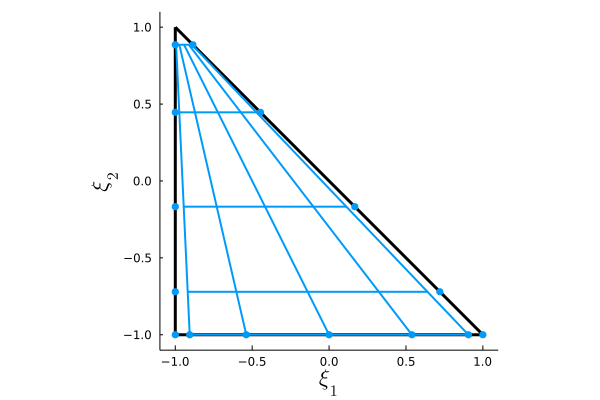

# CLOUD.jl: Conservation Laws on Unstructured Domains

CLOUD.jl is a Julia framework for the numerical solution of partial differential equations of the form
```math
\frac{\partial \underline{U}(\bm{x},t)}{\partial t} + \bm{\nabla}_{\bm{x}} \cdot \underline{\bm{F}}(\underline{U}(\bm{x},t), \bm{\nabla}_{\bm{x}}\underline{U}(\bm{x},t)) = \underline{0},
```
subject to appropriate initial and boundary conditions, where $\underline{U}(\bm{x},t)$ is the vector of solution variables and $\underline{\bm{F}}(\underline{U}(\bm{x},t),\bm{\nabla}_{\bm{x}}\underline{U}(\bm{x},t))$ is the flux tensor containing advective and/or diffusive contributions. 
These equations are spatially discretized on curvilinear unstructured grids using discontinuous spectral element methods with the summation-by-parts property in order to generate `ODEProblem` objects suitable for time integration using [OrdinaryDiffEq.jl](https://github.com/SciML/OrdinaryDiffEq.jl) within the [SciML](https://sciml.ai/) ecosystem. 

The functionality provided by [StartUpDG.jl](https://github.com/jlchan/StartUpDG.jl) for the handling of mesh data structures, polynomial basis functions, and quadrature nodes is employed throughout this package. Moreover, CLOUD.jl employs dynamically dispatched strategies for semi-discrete operator evaluation using [LinearMaps.jl](https://github.com/JuliaLinearAlgebra/LinearMaps.jl), allowing for the efficient matrix-free application of tensor-product operators, including those associated with collapsed-coordinate formulations on triangles.

## Installation

To install CLOUD.jl, open a `julia` session and enter:

```julia
julia> import Pkg

julia> Pkg.add(url="https://github.com/tristanmontoya/CLOUD.jl.git")
```

## Basic Usage

As this documentation is currently a work in progress, we recommend that users refer to the following Jupyter notebooks for examples of how to use CLOUD.jl:
* [Linear advection-diffusion equation in 1D](https://github.com/tristanmontoya/CLOUD.jl/blob/main/examples/advection_diffusion_1d.ipynb)
* [Linear advection equation in 2D](https://github.com/tristanmontoya/CLOUD.jl/blob/main/examples/advection_2d.ipynb)

More detailed tutorials will be added soon!
## Conservation Laws

Wherever possible, CLOUD.jl separates the physical problem definition from the numerical discretization. The equations to be solved are defined by subtypes of `AbstractConservationLaw` on which functions such as `physical_flux` and `numerical_flux` are dispatched. Objects of type `AbstractConservationLaw` contain two type parameters, `d` and `PDEType`, the former denoting the spatial dimension of the problem, which is inherited by all subtypes, and the latter being a subtype of `AbstractPDEType` denoting the particular type of PDE being solved, which is either `FirstOrder` or `SecondOrder`. Whereas first-order problems remove the dependence of the flux tensor on the solution gradient in order to obtain systems of the form
```math
\frac{\partial \underline{U}(\bm{x},t)}{\partial t} + \bm{\nabla}_{\bm{x}} \cdot \underline{\bm{F}}(\underline{U}(\bm{x},t)) = \underline{0},
```
second-order problems are treated by CLOUD.jl as first-order systems of the form 
```math
\begin{aligned}
\underline{\bm{Q}}(\bm{x},t) - \bm{\nabla}_{\bm{x}} \underline{U}(\bm{x},t) &= \underline{0},\\
\frac{\partial \underline{U}(\bm{x},t)}{\partial t} + \bm{\nabla}_{\bm{x}} \cdot \underline{\bm{F}}(\underline{U}(\bm{x},t), \underline{\bm{Q}}(\bm{x},t)) &= \underline{0}.
\end{aligned}
```
CLOUD.jl also supports source terms of the form $\underline{S}(\bm{x},t)$, specifically for code verification using the method of manufactured solutions.

## Approximation on the Reference Element
Discretizations in CLOUD.jl are constructed by first building a local approximation on a canonical reference element, denoted generically as $\hat{\Omega} \subset \mathbb{R}^d$, and using a bijective transformation $\bm{X}^{(\kappa)} : \hat{\Omega} \rightarrow \Omega^{(\kappa)}$ to construct the approximation on each physical element of the mesh $\mathcal{T}^h = \{ \Omega^{(\kappa)}\}_{\kappa \in \{1:N_e\}}$ in terms of the associated operators on the reference element. In order to define the different geometric reference elements, existing subtypes of `AbstractElemShape` from StartUpDG.jl (e.g. `Line`, `Quad`, `Hex`, `Tri`, and `Tet`) are used and re-exported by CLOUD.jl. For example, we have 
```math
\begin{aligned}
\hat{\Omega}_{\mathrm{line}} &= [-1,1],\\
\hat{\Omega}_{\mathrm{quad}} &= [-1,1]^2,\\
\hat{\Omega}_{\mathrm{hex}} & = [-1,1]^3 \\
\hat{\Omega}_{\mathrm{tri}} &= \big\{ \bm{\xi} \in [-1,1]^2 : \xi_1 + \xi_2 \leq 0 \big\}.\\
\hat{\Omega}_{\mathrm{tet}} &= \big\{ \bm{\xi} \in [-1,1]^3 : \xi_1 + \xi_2 + \xi_3 \leq 0 \big\}.
\end{aligned}
```
These element types are used in the constructor for CLOUD.jl's `ReferenceApproximation` type, along with a subtype of `AbstractApproximationType` specifying the nature of the local approximation (and, optionally, the associated volume and facet quadrature rules). As an example, we can construct a collapsed-edge tensor-product spectral-element method of degree 4 on the reference triangle by first loading the CLOUD.jl package and then using the appropriate constructor:

```julia
julia> using CLOUD

julia> ref_elem_tri = ReferenceApproximation(CollapsedSEM(4), Tri())
```
Using CLOUD.jl's built-in plotting recipes, we can easily visualize the reference element for such a discretization:
```julia
julia> using Plots

julia> plot(ref_elem_tri, grid_connect=true)
```


## Spatial Discretizations
All the information used to define the spatial discretization on the physical domain $\Omega$ is contained within a `SpatialDiscretization` structure, which is constructed using a `ReferenceApproximation` and a `MeshData` from StartUpDG.jl, which are stored as the fields `reference_approximation` and `mesh`. When the constructor for a `SpatialDiscretization` is called, the grid metrics are computed and stored `GeometricFactors` structure, with the field being `geometric_factors`. CLOUD.jl provides utilities to easily generate uniform periodic meshes on line segments, rectangles, or rectangular prisms; using such a mesh and `ref_elem_tri` defined previously, we can construct a spatial discretization on the domain $\Omega = [0,1] \times [0,1]$ with four edges in each direction (a total of $N_e = 32$ elements) as shown below:

```julia
julia> mesh = uniform_periodic_mesh(ref_elem_tri, ((0.0, 1.0),(0.0,1.0), (4,4)))

julia> spatial_discretization = SpatialDiscretization(mesh, ref_elem_tri)
```

## License

This software is released under the [GPLv3 license](https://www.gnu.org/licenses/gpl-3.0.en.html).